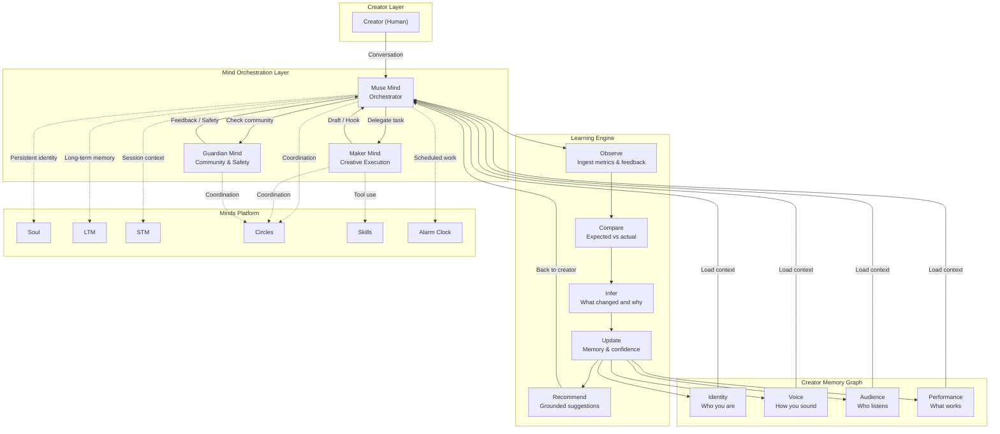

# MUSE -- The AI Creative Team That Learns You

[](https://nextjs.org/)
[](https://www.typescriptlang.org/)
[](https://www.npmjs.com/package/@animocabrands/minds-client-lib)
[]()
[]()

> **Muse remembers what makes your content work, learns from every result, and keeps working after you log off.**

---

## Table of Contents

- [Why Minds is Indispensable](#why-minds-is-indispensable)
- [The Core Loop](#the-core-loop)
- [Architecture Overview](#architecture-overview)
- [The Three Minds](#the-three-minds)
- [Creator Memory System](#creator-memory-system)
- [Learning Loop](#learning-loop)
- [Demo](#demo)
- [Tech Stack](#tech-stack)
- [Setup Instructions](#setup-instructions)
- [Environment Variables](#environment-variables)
- [API Reference](#api-reference)
- [Evidence & Honesty](#evidence--honesty)
- [Limitations (Honest)](#limitations-honest)
- [Project Structure](#project-structure)
- [Hackathon Info](#hackathon-info)

---

## Why Minds is Indispensable

**The "Remove Minds" test**: If you remove the Minds platform's persistence, memory, and circles from Muse, the product ceases to exist. Here is why:

| Minds Capability | What Muse Loses Without It | Result |
|---|---|---|
| **Soul (Persistent Identity)** | Muse forgets who the creator is between sessions. No voice profile. No style memory. | Becomes a stateless chatbot -- identical to every other AI tool |
| **LTM (Long-Term Memory)** | No accumulated creative intelligence. Every session starts from zero. | Cannot learn. Cannot improve. Cannot justify recommendations |
| **STM (Short-Term Memory)** | No conversational context. Cannot track a multi-step creative process. | Cannot orchestrate Maker and Guardian in a coherent workflow |
| **Circles (Multi-Mind Coordination)** | Muse, Maker, and Guardian become isolated. No delegation. No evaluation. | No "creative team." Just three disconnected chatbots |
| **Skills (Tool Equipping)** | Minds cannot take actions -- no drafting, no publishing, no analytics fetching. | Becomes purely advisory with no ability to act |
| **Alarm Clock (Scheduled Actions)** | No overnight work. No "I worked while you were offline." | Loses the core differentiator of persistent, proactive creative labor |

**Verdict**: Minds is not a feature of Muse. Minds IS Muse. Without it, you have a prompt-and-forget tool -- the exact thing we are building an alternative to.

---

## The Core Loop

Most AI creative tools follow: **Prompt -> Generate -> Done**.

Muse follows a fundamentally different loop:

```
Remember -> Learn -> Act -> Measure -> Remember
    ^                                   |
    |___________________________________|
```

1. **Remember** -- Load the creator's accumulated creative intelligence (voice, audience, winning hooks, past decisions)
2. **Learn** -- Observe what happened since last session (new metrics, creator feedback, content performance)
3. **Act** -- Generate recommendations, draft content, delegate to Maker, all grounded in memory
4. **Measure** -- Track outcomes of every action (did the hook work? did the creator accept or modify?)
5. **Remember** -- Write new learnings back to memory, closing the loop

This loop runs whether the creator is online or offline. That is the point.

---

## Architecture Overview



---

## The Three Minds

### Muse -- The Orchestrator

- **Role**: The creator's primary point of contact. Understands context, delegates work, synthesizes results.
- **What it does**: Loads creator memory, decides when to delegate to Maker, evaluates output quality, presents results to creator.
- **Minds features used**: Soul (identity), LTM (accumulated learning), STM (conversation), Alarm Clock (overnight triggers).

### Maker -- The Creative Executor

- **Role**: The creative workhorse. Generates hooks, drafts content, explores ideas -- always grounded in the creator's voice.
- **What it does**: Receives structured instructions from Muse (not open-ended prompts). Produces drafts, hook variants, content variations. Returns work for Muse's evaluation.
- **Minds features used**: Skills (content tools), STM (task context), Circles (receives delegation from Muse).

### Guardian -- The Community & Safety Mind

- **Role**: Protects the creator's relationship with their audience. Monitors community signals, flags risks, ensures consistency.
- **What it does**: Checks drafts against creator voice, monitors audience sentiment, flags content that could damage trust.
- **Minds features used**: Circles (community monitoring), LTM (audience patterns).

---

## Creator Memory System

The Creator Memory Graph stores four interconnected domains of creative intelligence:

### Identity Domain
- Niche, expertise areas, content pillars
- Values and boundaries (what the creator will not do)
- Brand positioning and differentiation

### Voice Domain
- Tone patterns (analyzed from past content)
- Vocabulary preferences and avoid-list
- Pacing, structure, and format patterns
- Voice consistency score (tracked over time)

### Audience Domain
- Demographic patterns (observed, not assumed)
- Engagement patterns by content type, time, hook type
- Response patterns to different tones and formats
- Growth trajectory and retention signals

### Performance Domain
- Hook effectiveness by type (question, bold claim, story, counter-intuitive, etc.)
- Content performance by format, length, topic
- Timing effectiveness (when posts perform best)
- Creator decision patterns (what they accept, modify, reject -- and why)

### Hooks and Decisions

- **Hooks**: Every hook is stored with its type, text, and measured effectiveness. Patterns emerge after enough data.
- **Creator Decisions**: Every recommendation gets a decision (accepted, modified, rejected, ignored). Modifications are captured for learning. This is how Muse learns what the creator actually wants vs. what it suggests.

---

## Learning Loop

The learning engine follows a rigorous observe-compare-infer-update-recommend cycle:

```
Observe -> Compare -> Infer -> Update -> Recommend
```

1. **Observe** -- Ingest new data: content metrics, creator feedback, audience signals, content performance.
2. **Compare** -- Expected performance vs. actual performance. Did the hook work as predicted? Did the content exceed or fall short?
3. **Infer** -- What changed? What patterns hold? What correlations emerged? **Critical**: Distinguish observed facts from correlations. Never claim causation without sufficient evidence.
4. **Update** -- Adjust confidence scores, update memory events, refine voice profile, recalibrate recommendations. Confidence decreases when sample size is small. Confidence increases only with consistent evidence.
5. **Recommend** -- Generate new suggestions grounded in updated memory. Every recommendation includes: what we suggest, why we suggest it (with evidence), and how confident we are.

### Statistical Honesty

- **Sample size gates**: No recommendation with fewer than 3 data points claims "pattern." Fewer than 10 does not claim "trend."
- **Confidence decay**: Confidence decreases over time without new confirming evidence.
- **Disclosure**: All simulated/demo data is labeled `isSimulation: true` and `source: 'prerecorded'` -- never hidden.

---

## Demo

### Running the Demo

1. Start the development server:
   ```bash
   bun run dev
   ```

2. Open the application in your browser. The demo is accessible from the **Demo** tab.

### Demo Scenes (90-Second Script)

The demo plays 10 scenes telling the story of Jules, a mid-tier creator:

| Scene | Description |
|-------|-------------|
| 1 | Jules opens Muse on phone -- sees today's briefing |
| 2 | Memory screen -- voice, audience, winning hooks |
| 3 | Jules says "I'm going offline" |
| 4 | Clock 22:00 -- Mind Theatre begins |
| 5 | Muse delegates to Maker with structured instructions |
| 6 | Maker returns; Muse evaluates (Voice 94%, Hook 91%) |
| 7 | 06:00 -- "Good morning. I worked while you were offline." |
| 8 | Persistence beat: "Why this hook?" -- cites 8 posts, 72% retention, 2 approvals |
| 9 | Learning beat: Mark underperforming -- Muse adjusts confidence |
| 10 | Closing: "A chatbot gives you an answer. Muse gets to know how you work." |

### Fallback Mode

When the Minds API is unavailable or degraded (>5s latency), the demo automatically switches to **pre-recorded fallback mode**:

- **Live mode**: Full Minds API integration, real conversations, real memory
- **Simulated mode**: Maker simulator generates responses locally, Minds API used for persistence only
- **Pre-recorded mode**: All 10 scenes play from pre-recorded data. Seamless user experience.

All fallback data is clearly labeled. The transition between modes is invisible to the user.

### Demo Reliability Features

- **Health check**: `/api/demo/health` pings Minds API, cached for 30s, reports healthy/degraded/down
- **Rehearsal mode**: Auto-plays all 10 scenes at 3x speed to verify demo readiness before presentation
- **Pre-recorded turns**: Every scene has complete conversation turns, narration, and data snapshots

---

## Tech Stack

| Layer | Technology | Purpose |
|-------|-----------|---------|
| **Framework** | Next.js 16 (App Router) | Full-stack React framework |
| **Language** | TypeScript 5 | Type safety throughout |
| **Styling** | Tailwind CSS 4 + shadcn/ui | Utility-first CSS + component library |
| **Database** | Prisma ORM + SQLite | Schema, queries, migrations |
| **State** | Zustand + TanStack Query | Client state + server state |
| **AI Platform** | Minds SDK (`@animocabrands/minds-client-lib`) | Persistent AI minds with memory |
| **Auth** | NextAuth.js v4 | Authentication (available) |
| **Charts** | Recharts | Data visualization |
| **Animation** | Framer Motion | UI transitions |
| **Icons** | Lucide React | Icon library |

---

## Setup Instructions

### Prerequisites

- [Bun](https://bun.sh/) runtime (v1.0+)
- Node.js 18+ (for Next.js compatibility)
- Git

### Clone and Install

```bash
git clone https://github.com/sodiq-code/muse.git
cd muse
bun install
```

### Configure Environment

Create a `.env` file in the project root (see [Environment Variables](#environment-variables) below):

```bash
cp .env.example .env
# Edit .env with your Minds API credentials
```

### Initialize Database

```bash
bun run db:push
```

This creates the SQLite database and applies the Prisma schema (12 models).

### Start Development Server

```bash
bun run dev
```

The application runs on `http://localhost:3000`.

### Verify Setup

1. Open the application in your browser
2. Check the Demo tab for API health status
3. Run a demo rehearsal to verify all 10 scenes play correctly

---

## Environment Variables

| Variable | Required | Description |
|----------|----------|-------------|
| `DATABASE_URL` | Yes | SQLite database path (e.g., `file:./db/custom.db`) |
| `MINDS_BUILDER_API_KEY` | For live mode | Minds Builder API key |
| `MINDS_HUMAN_ID` | For live mode | Mind ID for the human creator |
| `MINDS_MUSE_ID` | For live mode | Mind ID for Muse (orchestrator) |
| `MINDS_MAKER_ID` | For live mode | Mind ID for Maker (creative executor) |
| `MINDS_MUSE_EMAIL` | For live mode | Email address for Muse mind |
| `MINDS_MAKER_EMAIL` | For live mode | Email address for Maker mind |
| `MINDS_MODE` | No | `live` or `simulate` (default: `simulate`) |
| `CREATOR_NAME` | No | Demo creator display name (default: `Creator`) |
| `CREATOR_EMAIL` | No | Demo creator email |
| `CREATOR_PLATFORM` | No | Primary platform (default: `youtube`) |

**Note**: The application runs in `simulate` mode by default. Live mode requires valid Minds API credentials.

---

## API Reference

### Dashboard Routes
| Route | Method | Description |
|-------|--------|-------------|
| `/api/dashboard/today` | GET | Today's briefing: priorities, pending, recommendations |
| `/api/dashboard/memory` | GET | Creator memory graph: identity, voice, audience, performance |
| `/api/dashboard/learning` | GET | Learning engine status: patterns, confidence, recent inferences |
| `/api/dashboard/overnight` | GET | Overnight work results: what Muse did while offline |
| `/api/dashboard/control` | GET | Control panel: delegations, approvals, autonomous runs |

### Creator Routes
| Route | Method | Description |
|-------|--------|-------------|
| `/api/creator` | GET/POST | Get or create a creator |
| `/api/creator/voice` | GET | Get creator voice profile |
| `/api/creator/voice/analyze` | POST | Analyze content to extract voice patterns |
| `/api/creator/memory` | GET | Get creator memory events |
| `/api/creator/decisions` | GET | Get creator decision history |
| `/api/creator/recruit` | POST | Creator recruitment flow |
| `/api/creator/audit` | GET | Creator audit trail |

### Content Routes
| Route | Method | Description |
|-------|--------|-------------|
| `/api/content` | GET/POST | List or create content items |
| `/api/content/ingest` | POST | Ingest content with metrics |
| `/api/content/performance` | GET | Content performance summary |
| `/api/content/metrics` | GET | Raw content metrics |

### Learning Routes
| Route | Method | Description |
|-------|--------|-------------|
| `/api/learning/run` | POST | Run a full learning cycle |
| `/api/learning/analyze` | POST | Analyze a specific content item |
| `/api/learning/comparison` | GET | Compare expected vs. actual performance |
| `/api/learning/rankings` | GET | Hook and content type rankings |
| `/api/learning/hooks` | GET | Hook pattern analysis |
| `/api/learning/predict` | POST | Predict content performance |
| `/api/learning/proof` | GET | Evidence for a specific learning |
| `/api/learning/explain` | GET | Explain why a recommendation was made |
| `/api/learning/honesty` | GET | Honesty verification for learning claims |

### Minds Routes
| Route | Method | Description |
|-------|--------|-------------|
| `/api/minds/status` | GET | Minds API health and configuration |
| `/api/minds/message` | POST | Send message to a mind |
| `/api/minds/history` | GET | Get conversation history |
| `/api/minds/circle` | GET | Get mind's circle members |
| `/api/minds/skills` | GET | Get mind's equipped skills |
| `/api/minds/draft` | POST | Generate draft via Maker |

### Delegation Routes
| Route | Method | Description |
|-------|--------|-------------|
| `/api/delegation/send` | POST | Delegate a task from Muse to Maker |
| `/api/delegation/evaluate` | POST | Evaluate Maker's output |
| `/api/delegation/beat` | GET | Get delegation beat (story element) |

### Autonomy Routes
| Route | Method | Description |
|-------|--------|-------------|
| `/api/autonomy/status` | GET | Get autonomous run status |
| `/api/autonomy/approve` | POST | Approve an autonomous action |
| `/api/autonomy/reject` | POST | Reject an autonomous action |
| `/api/autonomy/expire` | POST | Expire a pending approval |
| `/api/autonomy/approval-history` | GET | Get approval history |
| `/api/autonomy/run-overnight` | POST | Trigger overnight autonomous run |

### Feedback Routes
| Route | Method | Description |
|-------|--------|-------------|
| `/api/feedback/submit` | POST | Submit creator feedback |
| `/api/feedback/summary` | GET | Feedback summary statistics |
| `/api/feedback/refinements` | GET | Refinements based on feedback |
| `/api/feedback/gate` | GET | Feedback gate status |
| `/api/feedback/simulate` | POST | Simulate feedback (demo) |

### Audit Routes
| Route | Method | Description |
|-------|--------|-------------|
| `/api/audit/stats` | GET | Audit event statistics |
| `/api/audit/filtered` | GET | Filtered audit events |
| `/api/audit/export` | GET | Export audit trail |

### Validation Routes
| Route | Method | Description |
|-------|--------|-------------|
| `/api/validation/day1` | GET | Day 1 validation check |
| `/api/validation/run` | POST | Run full validation suite |
| `/api/validation/honesty` | GET | Honesty verification report |

### Demo Routes
| Route | Method | Description |
|-------|--------|-------------|
| `/api/demo/health` | GET | Minds API health and fallback status |
| `/api/demo/scene` | GET | Pre-recorded scene data |
| `/api/demo/rehearsal` | GET/POST | Demo rehearsal controls |

### Drafts Route
| Route | Method | Description |
|-------|--------|-------------|
| `/api/drafts` | GET/POST | List or create drafts |

---

## Evidence & Honesty

Muse takes epistemic honesty seriously. Every claim in the system is tagged with its evidence level:

### Evidence Levels

| Level | Label | Meaning | Example |
|-------|-------|---------|---------|
| 1 | **Observed** | Direct measurement, no inference | "Hook A got 72% retention across 8 posts" |
| 2 | **Correlation** | Pattern detected, causation not claimed | "Question hooks correlate with higher retention" |
| 3 | **Confidence-weighted** | Inference with explicit confidence score | "We predict 68% retention for this hook (confidence: 0.7, n=8)" |
| 4 | **Recommendation** | Actionable suggestion based on evidence | "Try a question hook -- your data supports this" |

### Disclosed Simulation

All demo and simulated data is labeled with:
- `isSimulation: true` -- This data was generated, not measured
- `source: 'prerecorded'` or `source: 'simulated'` -- Where the data came from
- **Never hidden**: The UI shows a transparency notice in demo mode

### Honesty Verification

The `/api/validation/honesty` and `/api/learning/honesty` endpoints provide a report on:
- Which data points are observed vs. simulated
- Which claims meet sample size thresholds
- Which confidence scores are calibrated vs. estimated

---

## Limitations (Honest)

### What We Have Built
- Full architecture with 12 database models and 33 service modules
- Working dashboard with 5 screens (Today, Memory, Learning, Overnight, Control)
- Creator memory system with 4 domains (Identity, Voice, Audience, Performance)
- Learning engine with observe-compare-infer-update-recommend cycle
- Delegation flow: Muse -> Maker -> Evaluation -> Creator
- Overnight autonomous work with approval gates
- Demo reliability: fallback mode, pre-recorded turns, health checks, rehearsal
- Minds SDK integration: Soul, LTM, STM, Circles, Skills, Alarm Clock

### What is Simulated (Disclosed)
- **Maker output**: In simulate mode, Maker's creative output is generated by a local simulator, not the Minds API
- **Content metrics**: Demo metrics are pre-recorded, not fetched from real platforms
- **Creator decisions**: Demo creator decisions are scripted for the 10-scene demo
- **Audience data**: Audience patterns are inferred from pre-recorded data, not live analytics
- **Performance predictions**: Predictions use simplified models with disclosed confidence levels

### What We Have Not Built
- **Real platform integrations**: No live YouTube/Twitter/Instagram API connections for metric ingestion
- **Multi-creator system**: Currently supports one creator at a time (demo mode)
- **Authentication flow**: NextAuth is configured but not the primary entry point for the demo
- **Production deployment**: This is a hackathon prototype, not production-hardened
- **A/B testing**: No controlled experiments to validate learning accuracy
- **Real-time audience monitoring**: Guardian monitors simulated community signals, not live data

### What Would Need Real Creators
- Voice profile accuracy requires real content analysis at scale (currently demo data)
- Hook effectiveness patterns need real publish-measure cycles across 20+ posts per creator
- Learning loop convergence requires weeks of real creator interaction, not a single session
- Overnight work value proposition can only be proven with creators who publish regularly

---

## Project Structure

```
muse/
  prisma/
    schema.prisma              # 12 models: Creator, ContentItem, ContentMetric,
                               # Hook, HookPattern, CreatorDecision, MemoryEvent,
                               # Recommendation, Draft, AutonomousRun, Approval, AuditEvent
  src/
    app/
      page.tsx                 # Main dashboard with 6 tabs
      layout.tsx               # Root layout
      api/                     # 34 API routes
        dashboard/             # 5 dashboard endpoints
        creator/               # 7 creator endpoints
        content/               # 4 content endpoints
        learning/              # 10 learning endpoints
        minds/                 # 6 Minds platform endpoints
        delegation/            # 3 delegation endpoints
        autonomy/              # 6 autonomy endpoints
        feedback/              # 5 feedback endpoints
        audit/                 # 3 audit endpoints
        validation/            # 3 validation endpoints
        demo/                  # 3 demo reliability endpoints
        drafts/                # 1 drafts endpoint
    lib/
      minds-client.ts          # Minds SDK wrapper
      minds-adapter.ts         # Minds <-> Muse adapter
      creator-service.ts       # Creator CRUD + voice
      learning-engine.ts       # Core learning engine
      learning-engine-service.ts # Learning service layer
      evaluation-service.ts    # Maker output evaluation
      delegation-service.ts    # Muse -> Maker delegation
      delegation-beat-service.ts # Delegation story beats
      decision-service.ts      # Creator decision tracking
      hook-classifier.ts       # Hook type classification
      hook-comparison.ts       # Hook effectiveness comparison
      voice-profiler.ts        # Voice pattern extraction
      performance-service.ts   # Content performance analysis
      explanation-service.ts   # Recommendation explanations
      honesty-verifier-service.ts # Epistemic honesty checks
      disclosed-simulation-service.ts # Simulation disclosure
      maker-simulator.ts       # Local Maker fallback
      overnight-scheduler-service.ts # Overnight work scheduling
      overnight-screen-service.ts # Overnight screen data
      autonomy-scheduler.ts    # Autonomous action scheduler
      draft-pipeline.ts        # Draft creation pipeline
      ingestion-pipeline.ts    # Content/metric ingestion
      control-screen-service.ts # Control screen data
      today-screen-service.ts  # Today screen data
      memory-screen-service.ts # Memory screen data
      learning-screen-service.ts # Learning screen data
      creator-feedback-service.ts # Feedback processing
      creator-recruitment.ts   # Creator onboarding
      e2e-validation-service.ts # End-to-end validation
      proof-experiment.ts      # Evidence/proof tracking
      demo-reliability-service.ts # Demo fallback + health
      demo-prerecorded-data.ts # 10-scene demo data
      seed.ts                  # Database seeding
      db.ts                    # Prisma client
      utils.ts                 # Utility functions
    components/
      ui/                      # shadcn/ui components (40+)
    hooks/
      use-minds-events.ts      # Minds event stream hook
      use-mobile.ts            # Mobile detection hook
      use-toast.ts             # Toast notification hook
  docs/
    architecture.md            # System architecture
    product-narrative.md       # Product story for judges
```

---

## Hackathon Info

| Field | Value |
|-------|-------|
| **Hackathon** | Creative Minds Jam #1: Hong Kong |
| **Organizers** | DoraHacks x Animoca Minds |
| **Track** | 1 -- Audience Growth & Engagement |
| **Mind ID** | `9fd0483e-f36b-1410-8466-00039ce7df11` |
| **Repository** | [github.com/sodiq-code/muse](https://github.com/sodiq-code/muse) |
| **Deadline** | August 28, 2026, 23:59 HKT |
| **Investment Path** | Animoca Minds $250K Investment Programme |

### Track Alignment

Muse competes in **Track 1: Audience Growth & Engagement** because:

1. **Learning from audience signals**: The Learning Engine observes what content resonates and adjusts recommendations -- this is audience engagement feedback loops, automated.
2. **Hook optimization**: By classifying and measuring hook effectiveness, Muse directly improves the first 5 seconds that determine whether an audience member stays or leaves.
3. **Persistent audience memory**: The Audience domain in the Creator Memory Graph accumulates knowledge about what works for THIS creator's specific audience -- not generic advice.
4. **Overnight work**: While the creator sleeps, Muse can analyze performance data and prepare improved strategies for the next day's content.

---

*Built for Creative Minds Jam #1. A chatbot gives you an answer. Muse gets to know how you work.*
