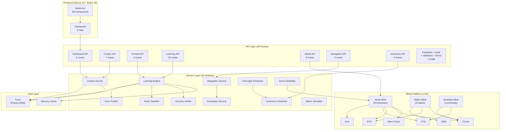

# MUSE Architecture

## System Architecture



## Data Flow: Creator to Memory and Back

```
1. Creator speaks to Muse
   Creator --> Muse Mind (STM: conversation context)
   Muse loads creator context --> Creator Memory Graph (LTM)

2. Muse delegates to Maker
   Muse --> Maker Mind (Circles: structured instruction)
   Maker --> Skills (draft, hook, content)
   Maker returns output --> Muse

3. Muse evaluates and presents
   Muse --> Evaluation Service (voice match, hook score)
   Muse presents to Creator --> Creator decides

4. Creator decision feeds learning
   Creator Decision --> Learning Engine
   Content Metrics --> Learning Engine
   Learning Engine --> Observe --> Compare --> Infer --> Update

5. Update writes to memory
   Learning Engine --> Creator Memory Graph
   Memory Graph --> Minds LTM (persistent)
   Memory Graph --> Turso (local copy)

6. Next session loads richer context
   Creator --> Muse --> LTM --> Creator Memory Graph (now larger)
```

## Real-Time Data Flow

```
SSE Events (/api/minds/events)
  --> Client EventSource connection
  --> Live Activity Feed (Today tab)
  --> Toast notifications (draft-complete, recommendation, approval-request)
  --> Auto-reconnect on failure

Auto-Polling (30s interval)
  --> Refresh minds status (credits, balance)
  --> Refresh today screen data
  --> Refresh autonomy status
  --> Dashboard stays current without page reload

Chat (/api/minds/chat)
  --> User types message
  --> POST to API route
  --> Minds SDK sendMessageAndWait (60s timeout)
  --> Muse AI reply streamed back
  --> Chat messages rendered in scrollable area
```

## Minds Platform Integration Points

| Minds Feature | Integration Point | Used By |
|---|---|---|
| **Soul** | Persistent mind identity — Muse remembers who it is across sessions | Muse |
| **LTM** | Long-term memory — stores accumulated creative intelligence | Muse, Guardian |
| **STM** | Short-term memory — active conversation context | Muse, Maker |
| **Circles** | Multi-mind coordination — Muse delegates to Maker, Maker reports back | Muse, Maker, Guardian |
| **Skills** | Tool equipping — Maker can draft, publish, fetch analytics | Maker |
| **Alarm Clock** | Scheduled actions — overnight work triggers, follow-up reminders | Muse |

## Database Schema Overview

```
Creator (1) ──── (N) ContentItem
Creator (1) ──── (N) CreatorDecision
Creator (1) ──── (N) MemoryEvent
Creator (1) ──── (N) Recommendation
Creator (1) ──── (N) Draft
Creator (1) ──── (N) Approval
Creator (1) ──── (N) AuditEvent

ContentItem (1) ──── (N) ContentMetric
ContentItem (1) ──── (N) Hook
ContentItem (1) ──── (N) CreatorDecision
ContentItem (1) ──── (N) Draft
ContentItem (1) ──── (N) AutonomousRun

Hook (1) ──── (N) HookPattern
```

**12 models total**. Schema is frozen (no changes without explicit approval).

## Key API Route Groups

| Group | Count | Purpose |
|---|---|---|
| Dashboard | 5 | Screen data for Today, Memory, Learning, Overnight, Control |
| Creator | 7 | Profile, voice, memory, decisions, audit, recruit |
| Content | 4 | CRUD, ingestion, performance, metrics |
| Learning | 10 | Full cycle: run, analyze, compare, predict, explain, honesty, hooks, rankings, proof |
| Minds | 8 | SDK proxy: status, chat, events, history, draft, skills, circle, message |
| Delegation | 3 | Send task, evaluate output, get story beat |
| Autonomy | 6 | Approve, reject, expire, status, history, overnight run |
| Feedback | 5 | Submit, summarize, refine, gate, simulate |
| Audit | 3 | Stats, filtered, export |
| Validation | 3 | Day 1 check, full run, honesty report |
| Demo | 3 | Health, scene, rehearsal |
| Drafts | 1 | CRUD |

**58 routes total**.

## Dashboard Screens

| Screen | API Endpoint | Key Data |
|--------|-------------|----------|
| **Today** | `/api/dashboard/today` | Greeting, overnight brief, top signals, pending approvals, new data counts |
| **Memory** | `/api/dashboard/memory` | Creator identity, voice radar, winning hooks, memory events |
| **Learning** | `/api/dashboard/learning` | Learning timeline, content items, confidence transitions |
| **Overnight** | `/api/dashboard/overnight` | Schedule, mind theatre, overnight output, last run time |
| **Control** | `/api/dashboard/control` | Autonomy settings, approval queue, audit log, pending count |
